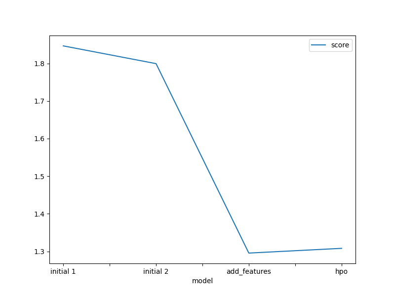
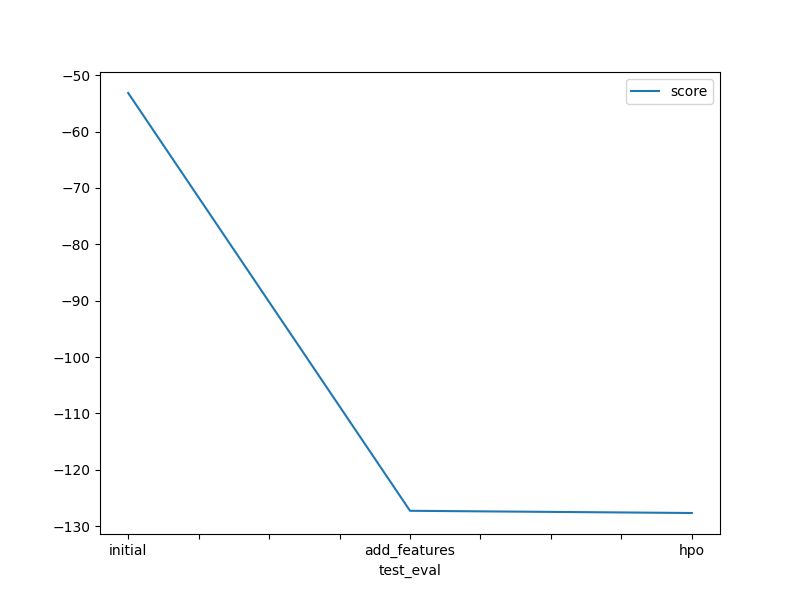

# Report: Predict Bike Sharing Demand with AutoGluon Solution
#### Raghavendra Kulkarni

## Initial Training
### What did you realize when you tried to submit your predictions? What changes were needed to the output of the predictor to submit your results?
When I submitted my predictions, I was wondering how seasonality/weather will impact demand for rental bikes and how model will consider that

### What was the top ranked model that performed?
Top ranked model was one with new features with a score of 1.29553

## Exploratory data analysis and feature creation
### What did the exploratory analysis find and how did you add additional features?
During exploratory analysis, when datetime was plotted, it appeared to show uniform distribution meaning it having no impact on performance, wondered if we could breakdown that to month, day and year to capture seasonality

### How much better did your model preform after adding additional features and why do you think that is?
Model performance score improved from 1.79951 (before adding features) to 1.29553 after adding features

## Hyper parameter tuning
### How much better did your model preform after trying different hyper parameters?
Model did not perform better after trying different hyperparameters. The score actually worsened little bit to 1.30813

### If you were given more time with this dataset, where do you think you would spend more time?
I would try to think and add more features that would predict bike demand

### Create a table with the models you ran, the hyperparameters modified, and the kaggle score.
|model|hpo1|hpo2|hpo3|score|
|--|--|--|--|--|
|initial|month|date|year|1.84672|
|add_features|month|date|year|1.29553|
|hpo|month|date|year|1.30813|

### Create a line plot showing the top model score for the three (or more) training runs during the project.

### Create a line plot showing the top kaggle score for the three (or more) prediction submissions during the project.

## Summary
This project demonstrated that using historical data and weather data, we can predict demand of bikes
